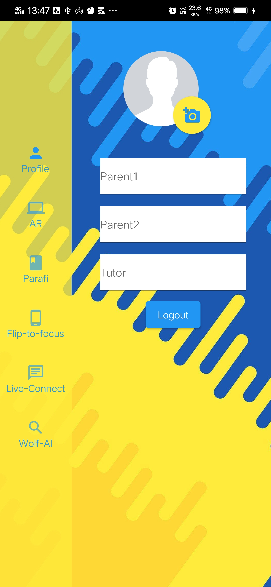

# STUD-BUD

**(Click the image to go to the video link of the App)**

In these recent times (due the COVID 19) , the whole of education is taking a toll while it’s tested all over the country online. With this new concept of ‘Online’ education happening for the very first time, there’s bound to challenges for both Students and Teachers. But now that online education has a vivd part of the system , it not’s going anytime soon and so the solutions to the challenges of online education are of urgency. So here come’s Stud-Bud to the rescue

StudBud aims to provide a very different approach to online studying. It will use concepts of Augmented Reality, Artificial Intelligence and many more technologies to bring a new way of studying and also get students all over the world get hooked on studying. StudBud will be an android mobile application which will get students fall in love with studies.

## Features:

### AUGMENTED REALITY

Students tend to miss out the experience of laboratory experiments in online classes and main reason for missing out is ‘Lack of Visualisation’. So Stud-Bud will incorporate 3D models and animations to give students a LIVE feel of laboratory classes. Students will be able to do functions with the models like - open camera place it on a plane, zoom in, zoom out, rotate etc etc with the models.

### PARAFI (Personal comprehension reader)

 

It is personalised Artificial Intelligence algorithm which will find answers of questions from the paragraph/passage. It is a feature that will help students locate answers from huge paragraphs of English comprehension and give solutions of entered questions within seconds. It will be a time-saver for students who tend to skip some part of comprehension and have to read it all over again and again to find answers.

### FLIP-TO-FOCUS

 

Students tend to use their mobile phones alot for personal reasons and hence there will be a timer to see how much time they are spending time with the application on and time when student is not using the phone at all. Parents and the tutors of the students will get a daily report with details like :- in screen time , in app time , time when phone switched off etc. It also include the details like : 1. Number of the Parents, Tutor 2. Import the profile pic according to one's liking.

### Wolf AI

 

Students generally tend to stumble over complex mathematical and science questions , many of which google cannot provide answers / steps to solve the problem. Wolf AI is a feature integrated in our application that will give solutions to most of the mathematical and science questions with steps to solve the problem. Just enter the question/equation and find the solution right away.

### LIVE CONNECT

 
 

Student and teachers need to have one on one interaction daily and hence this feature of connecting people with one on one chat and video conferencing will help interact with others much better.

### Concluding Statement
 Thus by implementing all the features in our app due to it's unique stucture and algorithms used we,Ctr-Alt-Elite , belive that no matter what happen in future the education of the upcoming generation will not be compromized.
 
### Credits
https://www.echoar.xyz/
#### Plugins Used: 
 page_transition: ^1.1.7+5
  shared_preferences:
  animated_text_kit: ^2.5.4
  flutter_login: ^1.0.14
  flutter_icons: ^1.1.0
  flare_flutter: ^2.0.6
  animator: ^2.0.2
  firebase_auth: ^0.18.3
  fluttertoast: ^7.1.5
  cloud_firestore: ^0.14.3+1
  firebase_storage: ^4.0.1
  image_cropper: ^1.3.1
  image_picker: ^0.6.7+14
  firebase_core: ^0.5.2+1
  model_viewer:
  hexcolor:
  all_sensors:
  http: ^0.12.2
  html: ^0.14.0+4
  flutter_tts: ^3.0.0
  agora_rtc_engine: 1.0.5
  permission_handler: ^3.0.0
  flutter_otp: ^0.3.2
 
#### Regards,
#### Team, Ctrl-Alt-Elite

